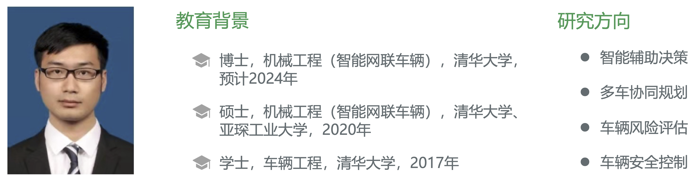

# 刘艺璁

## 科研项目

### X科委--智能网联XX平台研发

#### 智能辅助决策

- 针对动态环境下异质多智能体任务规划问题，建立了基于多目标优化的高效辅助决策算法，完成了系统集成与性能测试
- 算法支持多模态人机交互方式，能在任意给定时间提供3-5个优化后的特征方案，并能根据任务执行情况动态调整行动方案

#### 多车协同规划

- 针对多智能车协同路径与轨迹安全高效规划问题，提出了风险约束下多车最优路径与次优轨迹规划算法，完成了仿真测试，正进行实车部署
- 经理论方法优化，算法成功率提升43%、计算用时缩短59%，相比现有算法能更好地平衡多车协同规划的安全性和高效性，支持多类非结构化与结构化交通场景下的实际应用

### 英特尔--非理想信息下智能网联车辆创新应用

- 针对恶意攻击与干扰下网联车辆控制器设计问题，提出了基于可达性分析与可满足性模理论的车辆鲁棒最优控制算法，完成了仿真与实车测试
- 算法能在任意有界对抗信息下保证车辆行驶安全并兼顾控制性能，相比Tube-MPC的跟踪性能提升17%、实时性提升63%

### 丰田--中国交通环境下智能网联车辆技术研究

- 针对驾驶辅助系统渗透率对交通安全性影响问题，建立了非信控交叉路口下碰撞预警技术渗透率仿真算法，完成了仿真分析
- 算法支持在不同技术渗透率下对行车风险进行评估，掲示了碰撞预警技术渗透率与各项安全性指标之间的对应关系

## 研究成果

### 学术论文

- **Y. Liu**, H. Huang, Q. Xu, S. Xu, J. Wang*, **Safer Conflict-Based Search: Risk-Constrained Optimal Pathfinding for Multiple Connected and Automated Vehicles**, IEEE Transactions on Automation Science and Engineering (T-ASE), under 2nd review, [PDF](/papers/IEEE-TASE.pdf).（SCI索引，IF=6，Top期刊，第一作者）
- Q. Xu, **Y. Liu***, J. Pan, J. Wang, J. Wang, K. Li, **Reachability Analysis Plus Satisfiability Modulo Theories: An Adversary-Proof Control Method for Connected and Autonomous Vehicles**, IEEE Transactions on Industrial Electronics (T-IE), 2022, [PDF](/papers/IEEE-TIE.pdf).（SCI索引，IF=8，Top期刊，学生第一且唯一通讯作者）
- **Y. Liu**, J. Wang, C. Chen, Q. Xu, L. Li*, **Vehicle Safety Analysis at Non-Signalised Intersections at Different Penetration Rates of Collision Warning Systems**, IET Intelligent Transport Systems (IET-ITS), 2021, [PDF](/papers/IET-ITS.pdf).（SCI索引，IF=3，第一作者）
- **Y. Liu**, C. Chen, M. Cai, H. Huang, Q. Xu, J. Wang*, **Multiple Unmanned Ground Vehicles Cooperative Trajectory Planning with Flexible Safety Guarantees**, IEEE International Conference on Unmanned Systems (ICUS), 2023, [PDF](/papers/IEEE-ICUS.pdf).（EI索引，第一作者）
- H. Huang, **Y. Liu**, J. Liu, Q. Yang, J. Wang*, D. Abbink, A. Zgonnikov, **General Optimal Trajectory Planning: Enabling Autonomous Vehicles with the Principle of Least Action**, Engineering, 2023.
- Z. Han, **Y. Liu**, J. Wang*, **Multi-agent Task Assignment Based on the Situation Field and Game Theory**, China Conference on Command and Control, 2022.

### 发明专利

- **刘艺璁**, 王建强等, **对抗信息下车辆的跟车控制方法、装置、车辆及存储介质**, CN115629606A, 2023.（已公开，第一发明人）
- 王建强, **刘艺璁**等, **多无人车任务分配方法、装置、车辆及存储介质**, CN115526417A, 2022.（已公开，学生第一发明人）
- 王建强, **刘艺璁**等, **不同网联程度下自动驾驶系统智能水平的测评方法及装置**, CN110414803A, 2022.（已授权，学生第一发明人）

### 教材专著

- 参与编著[**《智能网联汽车》**](http://www.tup.tsinghua.edu.cn/booksCenter/book_09165001.html)教材
- 陈超义, 许庆, 王建强, **刘艺璁**, **《车路协同控制与服务技术》**, 2024.（正在出版）

## 联系方式

- 邮箱：liu.yicong@qq.com
- 微信：imliuyc
